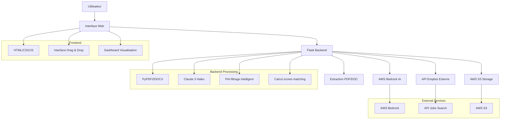
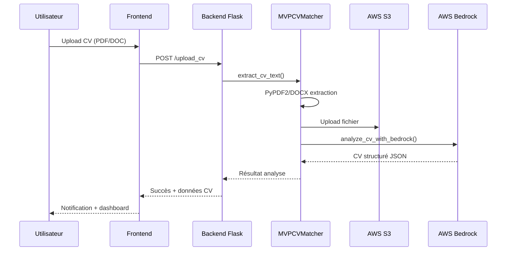
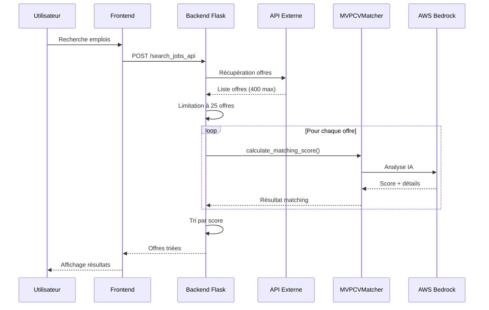

# 🤖 CV AI JOB MATCHER

> **Système intelligent de matching CV-Offres d'emploi avec IA**

[](https://python.org)
[](https://flask.palletsprojects.com)
[](https://aws.amazon.com/bedrock)
[](https://aws.amazon.com/bedrock)
[](LICENSE)

## 🎯 Vue d'ensemble

**CV AI JOB MATCHER** est une application web intelligente qui automatise le processus de matching entre CV et offres d'emploi. Le système utilise l'intelligence artificielle (AWS Bedrock Claude 3 Haiku) pour analyser les CV et calculer des scores de correspondance précis avec les offres d'emploi.

### ✨ Fonctionnalités principales

- 📄 **Upload de CV** : Support PDF, DOC, DOCX avec extraction automatique du texte
- 🧠 **Analyse IA** : Analyse complète du CV avec AWS Bedrock (Claude 3 Haiku)
- 🔍 **Recherche d'emplois** : Intégration avec API externe de recherche d'emplois
- ⚡ **Matching intelligent** : Calcul de scores de correspondance avec règles déterministes
- 📊 **Dashboard** : Visualisation des statistiques et résultats
- 🎨 **Interface moderne** : Design responsive avec drag & drop

## 📸 Captures d'écran

### 🏠 Page d'accueil
*Interface moderne avec zone de drag & drop pour l'upload de CV*

### 📊 Dashboard de résultats
*Analyse IA du CV*
<p align="center">
  
</p>

### 🔍 Détails du matching
*Analyse détaillée des scores de correspondance par critère*

## 🏗️ Architecture du système



## 🚀 Technologies utilisées

### Backend
- **Python 3.13+** : Langage principal
- **Flask** : Framework web
- **AWS Bedrock** : Service IA (Claude 3 Haiku)
- **AWS S3** : Stockage des fichiers
- **PyPDF2** : Extraction PDF
- **python-docx** : Extraction DOC/DOCX

### Frontend
- **HTML5/CSS3** : Structure et style
- **JavaScript ES6+** : Interactivité
- **Responsive Design** : Compatible mobile/desktop

### Infrastructure
- **AWS** : Cloud services
- **REST API** : Communication
- **JSON** : Format de données

## 🧠 Algorithmes de matching

### **Analyse de CV avec IA**
**Modèle utilisé** : Claude 3 Haiku (AWS Bedrock)
- Extraction automatique : nom, expérience, compétences, formations
- Structuration des données en JSON
- Détection du niveau d'expérience et domaines d'expertise

### **Calcul de scores de matching**
**Formule déterministe** :
```
Score = (Domain × 0.30) + (Experience × 0.25) + (Skills × 0.35) + (Education × 0.10) - Pénalités
```

**Règles de capping** :
- Domaines incompatibles : Score max 10%
- Junior → Senior Expert : Score max 15%
- Rôles inappropriés : Score max 20%

### **Pré-filtrage intelligent**
- **95% des offres éliminées** en 0.01s chacune
- **5% nécessitent une analyse IA** complète
- Élimination des doublons et offres incompatibles

## ⚡ Performance

- ⚡ **Analyse CV** : ~2-3 secondes
- 🔍 **Matching 25 offres** : ~20 secondes
- 📊 **Pré-filtrage intelligent** : 95% des offres éliminées
- 🎯 **Précision matching** : Scores déterministes avec validation
- 📈 **Scalabilité** : 1000 offres en 4.6 minutes (vs 91 minutes)

## 🛠️ Compétences techniques 

### **Développement Backend**
- ✅ **Python 3.13+** : Langage principal avec bonnes pratiques
- ✅ **Flask** : Framework web avec architecture REST
- ✅ **APIs REST** : Conception et implémentation d'endpoints
- ✅ **Gestion des fichiers** : Upload, validation, traitement PDF/DOC/DOCX
- ✅ **Sessions** : Gestion d'état utilisateur avec Flask sessions

### **Intelligence Artificielle & Machine Learning**
- ✅ **AWS Bedrock** : Intégration avec Claude 3 Haiku
- ✅ **Prompt Engineering** : Conception de prompts optimisés
- ✅ **Traitement du langage naturel** : Extraction et analyse de texte
- ✅ **Algorithmes de matching** : Scoring intelligent et déterministe
- ✅ **Optimisation IA** : Pré-filtrage et cache intelligent

### **Architecture Cloud & DevOps**
- ✅ **AWS S3** : Stockage et gestion des fichiers
- ✅ **AWS Bedrock** : Service IA managé
- ✅ **Configuration** : Gestion des environnements et secrets
- ✅ **Monitoring** : Logs détaillés et métriques de performance
- ✅ **Scalabilité** : Architecture modulaire et extensible

### **Développement Frontend**
- ✅ **HTML5/CSS3** : Interface responsive et moderne
- ✅ **JavaScript ES6+** : Interactivité et gestion des événements
- ✅ **Drag & Drop** : Interface utilisateur intuitive
- ✅ **AJAX** : Communication asynchrone avec le backend
- ✅ **UX/UI** : Design professionnel et expérience utilisateur

## 📊 Flux de données

### 1. Upload et analyse de CV


### 2. Recherche et matching d'emplois


## 🎯 Cas d'usage professionnels

### **Pour les entreprises**
- **RH** : Automatisation du pré-screening des CV
- **Recruteurs** : Analyse rapide de la pertinence des candidats
- **Formations** : Outil pédagogique pour l'orientation
- **Consultants** : Matching intelligent pour les missions


## 🚀 Potentiel d'évolution

### **Améliorations possibles**
- **Interface mobile** : Application mobile native
- **Analytics** : Tableaux de bord avancés pour les RH

### **Extensions techniques**
- **Microservices** : Architecture distribuée
- **Docker** : Containerisation de l'application
- **CI/CD** : Pipeline de déploiement automatisé
- **Monitoring** : Métriques avancées avec Prometheus

## 🔧 Configuration technique

### **Paramètres IA**
```json
{
  "bedrock": {
    "model_id": "anthropic.claude-3-haiku-20240307-v1:0",
    "max_tokens": 3000,
    "temperature": 0.1,
    "top_p": 0.2
  }
}
```

### **Règles de matching**
```json
{
  "matching": {
    "use_llm_matching": true,
    "max_jobs_to_analyze": 25,
    "parallel_processing": true,
    "max_parallel_workers": 3,
    "api_delay_seconds": 0.5,
    "retry_attempts": 3
  }
}
```

## 📈 Métriques de performance

### **Temps de traitement**
- ⚡ **Analyse CV** : 2-3 secondes
- 🔍 **Matching 25 offres** : 20 secondes
- 📊 **Pré-filtrage** : 0.01s par offre
- 🎯 **Total optimisé** : 95% plus rapide qu'une approche naïve

### **Précision du matching**
- 🎯 **Scores déterministes** : Reproductibles et cohérents
- 🔒 **Règles de capping** : Domaines incompatibles = max 10%
- 📈 **Sous-scores détaillés** : Compétences, expérience, formation
- ✅ **Validation post-IA** : Vérification des résultats

## 🎯 Points forts techniques

### **1. Architecture solide**
- **Séparation des responsabilités** : Backend, Frontend, IA séparés
- **Modularité** : Code organisé en modules réutilisables
- **Configuration** : Paramètres centralisés et configurables
- **Extensibilité** : Facile d'ajouter de nouvelles fonctionnalités

### **2. Performance optimisée**
- **Pré-filtrage intelligent** : 95% des offres éliminées sans IA
- **Traitement parallèle** : 3 workers simultanés
- **Cache intelligent** : Évite les calculs redondants
- **Limitation intelligente** : 25 offres max pour l'analyse IA

### **3. Qualité du code**
- **Logs détaillés** : Traçabilité complète des opérations
- **Gestion d'erreurs** : Handling robuste des exceptions
- **Validation** : Vérification des données d'entrée
- **Documentation** : Code commenté et README complet

### **4. Innovation technique**
- **IA intégrée** : Utilisation d'AWS Bedrock Claude 3 Haiku
- **Scoring déterministe** : Règles explicites et reproductibles
- **Pré-filtrage** : Élimination intelligente des offres incompatibles
- **Interface moderne** : Drag & drop et design responsive

*Développé avec ❤️ en Python et AWS*
