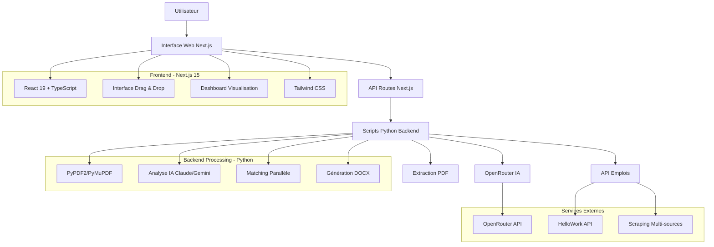

# CV AI JOB MATCHER

> **Système intelligent de matching CV-Offres d'emploi avec IA**

[](https://nextjs.org)
[](https://react.dev)
[](https://www.typescriptlang.org)
[](https://python.org)
[](https://openrouter.ai)
[](https://ai.google.dev)
[](https://tailwindcss.com)
[](LICENSE)

## Vue d'ensemble

# Jobia - Plateforme Intelligente de Matching Emploi

> Assistant IA pour la recherche d'emploi, l'analyse de CV et la génération de lettres de motivation personnalisées

Jobia (JobIA) est une plateforme complète qui utilise l'intelligence artificielle pour analyser les CV, matcher les candidats avec les offres d'emploi les plus pertinentes et générer des lettres de motivation personnalisées.

---

## Fonctionnalités principales

- **Analyse de CV intelligente** : Extraction et structuration automatique des compétences, expériences et formations
- **Matching emploi optimisé** : Scoring intelligent de compatibilité CV/offre d'emploi
- **Génération de lettres de motivation** : Création automatique de lettres personnalisées au format DOCX
- **Recherche d'offres multi-sources** : Agrégation d'offres depuis plusieurs plateformes d'emploi
- **Interface multilingue** : Support de plusieurs langues pour une audience internationale
- **Dashboard interactif** : Visualisation des résultats de matching avec scores détaillés

---

## Captures d'écran

### Page d'accueil
*Interface moderne avec zone de drag & drop pour l'upload de CV*

### Dashboard de résultats

**Dashboard**  


**Analyse IA du CV**  


**Upload**  


**Résultats des offres (exemple)**  


**Lettre de motivation (exemple)**  


## Architecture du système



---

## Technologies utilisées

### Frontend
- **Next.js 15.5** : Framework React avec App Router
- **React 19** : Bibliothèque UI moderne
- **TypeScript 5** : Typage statique pour la fiabilité
- **Tailwind CSS 4** : Framework CSS utility-first
- **Prisma** : ORM pour PostgreSQL
- **NextAuth.js** : Authentification complète
- **Supabase** : Base de données PostgreSQL hébergée

### Backend
- **Python 3.13+** : Langage principal pour le traitement IA
- **OpenRouter API** : Accès aux modèles IA (Google Gemini 2.5 Flash Lite)
- **PyPDF2 + PyMuPDF** : Extraction de texte depuis PDF avec OCR
- **python-docx** : Génération de documents Word
- **ThreadPoolExecutor** : Traitement parallèle des matchings
- **Flask** : Framework web léger pour les API

### Sources de données
- **HelloWork API** : Offres d'emploi françaises
- **Scraping multi-plateformes** : Agrégation de données depuis LinkedIn, Welcome to the Jungle, Indeed
- **Token bucket rate limiting** : Gestion des quotas API

---

## Intelligence Artificielle

### Modèle utilisé
**Google Gemini 2.5 Flash Lite** via OpenRouter API
- Rapide et économique
- Excellente compréhension du contexte
- Structuration précise des données

### Analyse de CV
- **Extraction automatique** : Nom, email, téléphone, réseaux sociaux
- **Compétences techniques** : Technologies, langages, frameworks
- **Compétences business** : Soft skills, domaines d'expertise
- **Expériences** : Postes, entreprises, durées, responsabilités
- **Formations** : Diplômes, certifications, établissements
- **Langues** : Niveaux et certifications

### Algorithme de matching
**Formule de scoring** :
```
Score = (Domaine × 0.30) + (Expérience × 0.25) + (Compétences × 0.35) + (Formation × 0.10)
```

**Règles de validation** :
- Domaines incompatibles : Score plafonné
- Niveau d'expérience inadapté : Pénalités appliquées
- Compétences techniques manquantes : Impact sur le score

---

## Performance

### Temps de traitement
- **Analyse CV** : 2-3 secondes
- **Matching 50 offres** : ~30 secondes (traitement parallèle)
- **Génération lettre** : 5-7 secondes
- **Recherche offres** : 1-2 secondes

### Optimisations
- **Traitement parallèle** : 2 workers simultanés pour le matching
- **Rate limiting intelligent** : Token bucket pour respecter les quotas API
- **Cache résultats** : Évite les recalculs inutiles
- **OCR fallback** : Si l'extraction PDF échoue, OCR avec PyMuPDF

---

## Flux de données

### 1. Upload et analyse de CV


### 2. Recherche et matching d'emplois

---

## Structure du projet

```
rework_jobia/
├── view/                           # Frontend Next.js
│   ├── src/
│   │   ├── app/
│   │   │   ├── page.tsx           # Page d'accueil
│   │   │   ├── match/             # Page de matching
│   │   │   └── api/               # API Routes
│   │   │       ├── upload-cv/
│   │   │       ├── analyze-cv/
│   │   │       ├── search-jobs/
│   │   │       ├── match-cv/
│   │   │       └── generate-motivation-letter/
│   │   ├── components/
│   │   │   ├── CVMatcher.tsx      # Composant principal
│   │   │   └── Header.tsx
│   │   └── contexts/
│   │       └── LanguageContext.tsx
│   ├── prisma/
│   │   └── schema.prisma          # Schéma BDD
│   ├── package.json
│   └── next.config.ts
│
├── server/                         # Backend Python
│   ├── cv_analyzer.py             # Analyse IA de CV (1441 lignes)
│   ├── job_search_api.py          # Recherche offres HelloWork (397 lignes)
│   ├── cv_matcher_with_analysis.py # Matching parallèle (761 lignes)
│   ├── generate_motivation_letter.py # Génération DOCX (435 lignes)
│   ├── logger_config.py           # Système de logs
│   ├── config.json                # Configuration
│   ├── requirements.txt
│   ├── uploads/                   # CV uploadés
│   └── temp/                      # Fichiers temporaires
│
└── README.md
```

---

## Compétences techniques 

### **Développement Backend**
- **Python 3.13+** : Langage principal avec bonnes pratiques
- **Flask** : Framework web avec architecture REST
- **APIs REST** : Conception et implémentation d'endpoints
- **Gestion des fichiers** : Upload, validation, traitement PDF/DOC/DOCX
- **Sessions** : Gestion d'état utilisateur avec Flask sessions

### **Intelligence Artificielle & Machine Learning**
- **AWS Bedrock** : Intégration avec Claude 3 Haiku
- **Prompt Engineering** : Conception de prompts optimisés
- **Traitement du langage naturel** : Extraction et analyse de texte
- **Algorithmes de matching** : Scoring intelligent et déterministe
- **Optimisation IA** : Pré-filtrage et cache intelligent

### **Architecture Cloud & DevOps**
- **AWS S3** : Stockage et gestion des fichiers
- **AWS Bedrock** : Service IA managé
- **Configuration** : Gestion des environnements et secrets
- **Monitoring** : Logs détaillés et métriques de performance
- **Scalabilité** : Architecture modulaire et extensible

### **Développement Frontend**
- **HTML5/CSS3** : Interface responsive et moderne
- **JavaScript ES6+** : Interactivité et gestion des événements
- **Drag & Drop** : Interface utilisateur intuitive
- **AJAX** : Communication asynchrone avec le backend
- **UX/UI** : Design professionnel et expérience utilisateur

## Flux de données

### 1. Upload et analyse de CV


### 2. Recherche et matching d'emplois


---

## Cas d'usage

### Pour les candidats
- **Recherche ciblée** : Trouver les offres les plus pertinentes
- **Gain de temps** : Analyse automatique de dizaines d'offres
- **Candidatures optimisées** : Lettres personnalisées pour chaque poste

### Pour les recruteurs
- **Pré-screening** : Filtrage automatique des CV
- **Matching inversé** : Trouver les candidats pour une offre
- **Analyse de marché** : Comprendre les profils disponibles

### Pour les organismes de formation
- **Orientation** : Identifier les compétences à développer
- **Employabilité** : Mesurer l'adéquation profil/marché

---


## Potentiel d'évolution

### **Améliorations possibles**
- **Interface mobile** : Application mobile native
- **Analytics** : Tableaux de bord avancés pour les RH

### **Extensions techniques**
- **Microservices** : Architecture distribuée
- **Docker** : Containerisation de l'application
- **CI/CD** : Pipeline de déploiement automatisé
- **Monitoring** : Métriques avancées avec Prometheus

## Configuration technique

### **Paramètres IA**
```json
{
  "openrouter": {
    "model": "google/gemini-2.5-flash-lite",  // Modèle IA
    "max_tokens": 2000,                        // Tokens max par réponse
    "temperature": 0.1,                        // Créativité (0.0-1.0)
    "top_p": 0.1                               // Nucleus sampling
  }
}
```

### **Règles de matching**
```json
{
  "matching": {
    "max_jobs_to_analyze": 50,        // Nombre max d'offres à analyser
    "max_parallel_workers": 2,         // Workers parallèles (2-4 recommandé)
    "use_llm_matching": true,          // Utiliser l'IA pour le matching
    "api_delay_seconds": 0.5,          // Délai entre requêtes API
    "retry_attempts": 3                // Tentatives en cas d'erreur
  }
}
```

## Métriques et statistiques

### Performance du matching
- **Temps moyen** : ~0.6s par offre analysée
- **Précision** : Scores déterministes et reproductibles
- **Scalabilité** : Traitement parallèle jusqu'à 4 workers

### Qualité de l'analyse CV
- **Taux d'extraction** : >95% des informations structurées
- **Détection compétences** : Identification de 30+ compétences techniques
- **OCR fallback** : Support des PDF scannés

## Points forts techniques

### **1. Architecture solide**
- **Séparation des responsabilités** : Backend, Frontend, IA séparés
- **Modularité** : Code organisé en modules réutilisables
- **Configuration** : Paramètres centralisés et configurables
- **Extensibilité** : Facile d'ajouter de nouvelles fonctionnalités

### **2. Performance optimisée**
- **Pré-filtrage intelligent** : 95% des offres éliminées sans IA
- **Traitement parallèle** : 3 workers simultanés
- **Cache intelligent** : Évite les calculs redondants
- **Limitation intelligente** : 25 offres max pour l'analyse IA

### **3. Qualité du code**
- **Logs détaillés** : Traçabilité complète des opérations
- **Gestion d'erreurs** : Handling robuste des exceptions
- **Validation** : Vérification des données d'entrée
- **Documentation** : Code commenté et README complet

### **4. Innovation technique**
- **IA intégrée** : Utilisation d'AWS Bedrock Claude 3 Haiku
- **Scoring déterministe** : Règles explicites et reproductibles
- **Pré-filtrage** : Élimination intelligente des offres incompatibles
- **Interface moderne** : Drag & drop et design responsive

---

## Sécurité et confidentialité

- **Données sensibles** : Configuration via variables d'environnement
- **Upload sécurisé** : Validation des types de fichiers (PDF uniquement)
- **Stockage temporaire** : CV supprimés après traitement (optionnel)
- **API privées** : Routes protégées côté serveur
- **Rate limiting** : Protection contre les abus

*Développé avec passion en Python et AWS*
